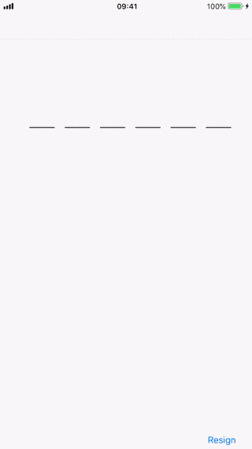

# SMSTextField
Subclass of UITextField with underline for sms verification code inputing



## Usage

Put `JHCodeTextField.swift` into your project, setup via sample codes below

```Swift
class ViewController: UIViewController {

    @IBOutlet weak var codeTextField: JHCodeTextField!
    
    override func viewDidLoad() {
        super.viewDidLoad()
        
        codeTextField.update(textLimited: 6, textColor: .blue, font: UIFont.systemFont(ofSize: 30), underlineColor: .darkGray)
    }
}
```

